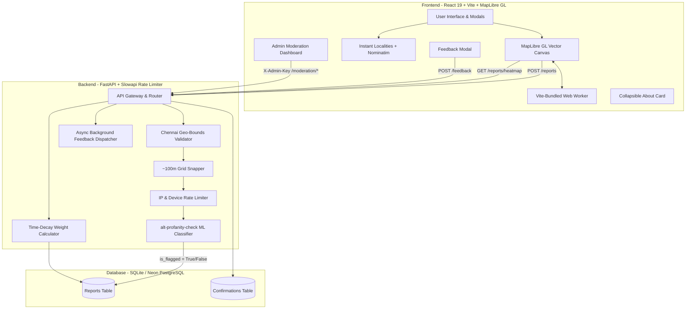
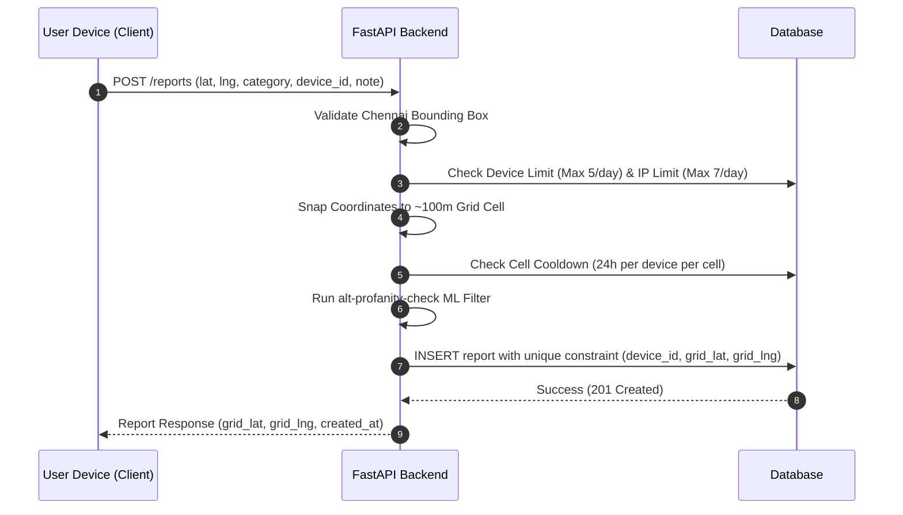
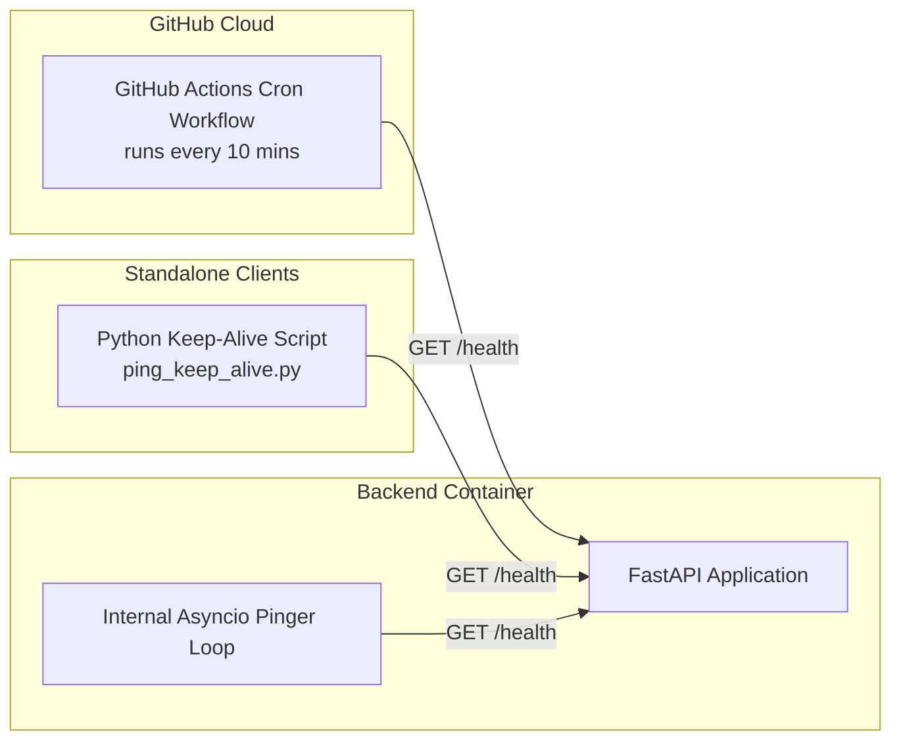

# Adiona — Chennai Safety Map

Adiona is a crowdsourced, privacy-first civic safety mapping platform built specifically for Chennai City. It empowers citizens to report and visualize localized infrastructure hazards, lighting concerns, and women's safety issues without requiring account creation, login credentials, or personal tracking.

---

## Key Features

- **100% Anonymous & Privacy-First**: No sign-ups, phone numbers, or cookies. User click coordinates are snapped server-side to ~100m grid cell centroids before database storage.
- **Cross-Device Clustered Map**: Powered by MapLibre GL with self-contained Vite worker bundling. Runs smoothly on all mobile devices, iOS Safari, Android WebViews, tablets, and desktops.
- **Instant 0ms Cluster Rendering**: Bundled with 289 pre-verified Chennai seed safety reports. Markers and clusters render instantly even during backend cold-starts.
- **0ms Instant Dark / Light Map Themes**: Uses high-performance vector tiles from OpenFreeMap (`bright` and `dark`) with in-memory GeoJSON caching for instant theme switching.
- **Hyperlocal Instant Search**: Combines a curated instant cache of 40+ major Chennai localities (T. Nagar, Velachery, Anna Nagar, Adyar, OMR, etc.) with OpenStreetMap Nominatim geocoding.
- **Private Community Feedback**: In-app feedback system routed through secure backend background tasks directly to maintainers with zero email exposure in frontend code.
- **Time-Decay Heatmap Algorithm**: Older unverified reports fade gracefully using an exponential decay schedule (~30-day half-life), while community-confirmed reports remain visible.
- **Automated ML Profanity Moderation**: Notes are screened via an `alt-profanity-check` machine learning classifier. Flagged reports are held in a secure moderation queue.
- **Deep-Link Coordinate Sharing**: Shareable URLs that sync map center coordinates and zoom levels in real time.

---

## System Architecture



---

## Privacy & Anonymity Pipeline

Adiona enforces privacy-by-design. Exact GPS/click coordinates are transformed server-side into grid cell centers before storage, ensuring exact user locations cannot be reverse-engineered.

```
[Exact User Click] -> (13.0827419, 80.2707123)
       |
       v
[Chennai Bounds Check] -> Validated (12.9205°–13.2405° N, 80.1070°–80.4270° E)
       |
       v
[~100m Grid Snapping] -> Formula: round(lat / step_lat) * step_lat
       |
       v
[Grid Cell Center] -> (13.083004, 80.270589) [STORED IN DATABASE]
       |
       v
[Public API Output] -> HeatmapPoint(lat, lng, weight, category, status)
                        (device_id is NEVER exposed in public endpoints)
```

### Anonymity & Rate Limit Controls



---

## Safety Categories

Categories maintain a strict semantic separation between general public infrastructure hazards and targeted women's safety concerns:

| Category Type | Category ID | Display Label | Description |
|---|---|---|---|
| **General Safety** | `poor_lighting` | Poor / No Lighting | Dark streets, non-functional streetlights |
| **General Safety** | `isolated_area` | Isolated / Deserted Area | Empty alleys, deserted walkways, abandoned spots |
| **General Safety** | `no_cctv` | No CCTV Coverage | Blind spots, unmonitored public corridors |
| **General Safety** | `stray_animal` | Stray Animal Risk | Aggressive stray dog packs, dangerous unmanaged animals |
| **General Safety** | `robbery_theft` | Robbery / Theft-Prone | Known snatching spots, mugging hazards |
| **General Safety** | `unsafe_road` | Unsafe Road / No Footpath | Broken pavement, high-speed traffic hazards |
| **General Safety** | `other_general` | Other General Issue | Other infrastructure or environment concerns |
| **Women Safety** | `catcalling` | Catcalling / Verbal Abuse | Leering, whistling, inappropriate comments |
| **Women Safety** | `stalking` | Stalking | Being followed, tracked, or persistently monitored |
| **Women Safety** | `physical_harassment` | Physical Harassment | Inappropriate contact, groping, physical threats |
| **Women Safety** | `unsafe_transport` | Unsafe Transport Stop | Poorly lit bus stops, unruly crowds, unsafe stands |
| **Women Safety** | `other_women` | Other Harassment | Other targeted harassment or threat concerns |

---

## Time-Decay Heatmap Weighting Algorithm

Heatmap point intensity decays over time using an exponential decay function with a ~30-day half-life, floored at `0.10` so older unconfirmed reports fade gracefully while confirmed spots maintain visibility:

$$W(t) = \max\left(0.10, e^{-0.023 \cdot t_{\text{days}}}\right) + \text{confirmations}$$

### Weight Decay Schedule

| Report Age ($t$) | Base Decay Weight ($e^{-0.023 \cdot t}$) | Weight (0 Confirmations) | Weight (2 Confirmations) | Visual Heatmap Intensity |
|---|---|---|---|---|
| **0 Days (New)** | 1.000 | **1.000** | **3.000** | High (Red / Orange) |
| **7 Days** | 0.851 | **0.851** | **2.851** | Moderate-High (Orange) |
| **30 Days** | 0.501 | **0.501** | **2.501** | Moderate (Yellow-Orange) |
| **90 Days** | 0.126 | **0.126** | **2.126** | Low-Moderate (Cyan) |
| **180+ Days** | < 0.100 (floored) | **0.100** | **2.100** | Minimum Floor (Dim Cyan) |

---

## Moderation Queue Workflow

Reports flagged by the machine learning profanity classifier (`is_flagged = True`) do not appear on the public heatmap immediately. They are held in the Moderation Queue for admin review:

```
[User Submits Note] 
        |
        v
[alt-profanity-check ML Model]
        |
        +---> Clean (is_flagged = False) -----> Immediately Rendered on Heatmap
        |
        +---> Profane (is_flagged = True) ----> Held in Moderation Queue (/moderation/reports)
                                                      |
                                                      +---> Admin Approves  ---> Published to Heatmap
                                                      |
                                                      +---> Admin Deletes   ---> Permanently Removed
```

---

## API Reference Table

| Method | Endpoint | Authorization | Description |
|---|---|---|---|
| `POST` | `/reports` | Public | Submit a grid-snapped safety report |
| `GET` | `/reports/heatmap` | Public | Query heatmap points with category, hours_back, and group filters |
| `POST` | `/reports/{id}/confirm` | Public | Confirm an existing safety report (1 per device) |
| `POST` | `/feedback` | Public | Submit user feedback, suggestions, ratings, or bug reports |
| `GET` | `/moderation/reports` | Admin Key | List flagged reports requiring admin review |
| `POST` | `/moderation/reports/{id}/approve` | Admin Key | Approve a flagged report and publish to heatmap |
| `DELETE` | `/moderation/reports/{id}` | Admin Key | Permanently delete a report from database |
| `GET` | `/moderation/stats` | Admin Key | Retrieve total, flagged, and safe report statistics |
| `GET` | `/health` | Public | Health check endpoint for uptime monitoring and keep-alive |

---

## Quality Assurance & Evaluation Matrix

Adiona runs comprehensive automated test suites across frontend and backend:

| Scope | Test File / Suite | Test Count | Result |
|---|---|---|---|
| **Security & Limits** | `backend/tests/test_security.py` | 28 tests | **PASSED** (0 SQLi, 0 out-of-bounds leaks, concurrency safe) |
| **Privacy & Anonymity** | `backend/tests/test_privacy.py` | 5 tests | **PASSED** (0 device_id leaks in public responses) |
| **Feedback System** | `backend/tests/test_feedback.py` | 4 tests | **PASSED** (Optional suggestions, rating bounds, async dispatch) |
| **Safety & Decay** | `backend/tests/test_safety_risk.py` | 3 tests | **PASSED** (Time-decay & moderation surfacing verified) |
| **Integration & Edge** | `backend/tests/test_integration_edge.py` | 6 tests | **PASSED** (Full E2E flow, midnight window, edge bounds) |
| **Performance & Scale** | `backend/tests/test_performance.py` | 2 benchmarks | **PASSED** (500 reqs < 5ms avg; 100k rows = 20.98 MB) |
| **Frontend Unit & A11y** | `frontend/src/test/*.test.jsx` | 29 tests | **PASSED** (Worker bundler, theme switch, modals, keyboard nav) |

### Test Suite Totals
- **Backend Test Suite (`pytest`)**: **77 / 77 Passed**
- **Frontend Test Suite (`vitest`)**: **29 / 29 Passed**
- **Production Build (`vite build`)**: **Clean Succeeded**

---

## Deployment Strategies (No Docker / No Kubernetes)

Adiona is designed to deploy easily to modern cloud platforms without requiring Docker or Kubernetes:

### 1. Recommended: Vercel (Frontend) + Railway / Render (Backend)
- **Frontend**: Connect your GitHub repository to [Vercel](https://vercel.com). Root configuration is handled automatically by [`vercel.json`](vercel.json).
- **Backend**: Connect repo to [Railway](https://railway.app) or [Render](https://render.com) using native Python. Set start command to `uvicorn app.main:app --host 0.0.0.0 --port $PORT`.
- **Database**: Use a free serverless PostgreSQL database from [Neon](https://neon.tech) by setting `DATABASE_URL=postgresql+asyncpg://...`.
- **Blue-Green Zero Downtime**: Vercel and Railway automatically perform atomic zero-downtime Blue-Green deployments on every Git push.

### 2. Alternative: Single Cloud VPS (Hetzner / DigitalOcean)
- Run FastAPI as a native `systemd` service (`adiona.service`).
- Build frontend with `npm run build` and serve `/dist` via **Nginx**.
- Nginx proxies `/reports`, `/feedback`, and `/moderation` to `http://127.0.0.1:8000`.
- SQLite database `safety_map.db` stays permanently stored on the VPS disk with zero data loss.
- Zero-downtime Blue-Green deploys can be achieved via Nginx upstream switching between port 8000 and 8001 with `nginx -s reload`.

---

## Keep-Alive & Cold-Start Architecture

To prevent Render free-tier instances from spinning down after 15 minutes of inactivity, a 3-layer keep-alive system is active:



---

## Project Structure

```
Adiona/
├── .github/
│   └── workflows/
│       └── keep_alive.yml         # Scheduled 10-min GitHub Actions keep-alive workflow
├── backend/
│   ├── app/
│   │   ├── config.py              # Application settings & environment variables
│   │   ├── db.py                  # Async SQLAlchemy database engine & session dependency
│   │   ├── main.py                # FastAPI entry point & CORS configuration
│   │   ├── models.py              # SQLAlchemy models (Report, Confirmation) & unique indexes
│   │   ├── schemas.py             # Pydantic request/response validation schemas
│   │   ├── routers/
│   │   │   ├── reports.py         # POST /reports, GET /heatmap, POST /confirm
│   │   │   ├── feedback.py        # POST /feedback (async background task dispatch)
│   │   │   └── moderation.py      # Moderation queue admin endpoints
│   │   └── services/
│   │       ├── geo_validator.py   # Server-side Chennai bounding box validation
│   │       ├── grid_snap.py       # ~100m grid cell snapping logic
│   │       ├── keep_alive.py      # Background asyncio pinger loop
│   │       ├── profanity.py       # alt-profanity-check ML classifier integration
│   │       └── rate_limiter.py    # IP slowapi & device daily limiters
│   ├── tests/                     # 77 Pytest unit, integration, and security tests
│   ├── seed_data.csv              # Curated historical Chennai safety incidents
│   ├── load_seed_data.py          # Seed data database loader
│   └── requirements.txt
├── frontend/
│   ├── src/
│   │   ├── components/
│   │   │   ├── AppContextCard.jsx # Collapsible About Adiona information card
│   │   │   ├── CategoryIcon.jsx   # Dynamic Lucide icon mapper
│   │   │   ├── ConfirmPrompt.jsx  # Confirmation modal dialog
│   │   │   ├── FeedbackModal.jsx  # Community feedback and star rating dialog
│   │   │   ├── FilterBar.jsx      # Category, time range, demographic filter panel
│   │   │   ├── MapView.jsx        # MapLibre GL map canvas & URL parameter sync
│   │   │   ├── ModerationModal.jsx# Admin moderation queue dashboard
│   │   │   ├── PrivacyNotice.jsx  # Privacy notice dialog & inline banner
│   │   │   ├── ReportMarkersLayer.jsx # Clustered markers layer with instant seed fallback
│   │   │   ├── ReportModal.jsx    # Report safety issue dialog with scrollable body
│   │   │   └── SearchBar.jsx      # Instant local cache + OSM Nominatim search
│   │   ├── data/
│   │   │   └── seedReports.json   # 289 pre-bundled Chennai reports for 0ms initial render
│   │   ├── hooks/
│   │   │   └── useDeviceId.js     # Persistent client UUID generator (localStorage)
│   │   ├── test/                  # 29 Vitest frontend & accessibility tests
│   │   ├── utils/                 # API client, bounds, categories, & map constants
│   │   ├── App.jsx
│   │   ├── index.css              # Custom styling & responsive media rules
│   │   └── main.jsx
│   ├── package.json
│   └── vite.config.js
├── vercel.json                    # Vercel SPA routing, API rewrites, and asset headers
└── README.md
```

---

## Getting Started Locally

### Prerequisites
- Python 3.10+
- Node.js 18+

### 1. Backend Setup

```bash
cd backend
python -m venv .venv

# Windows PowerShell
.\.venv\Scripts\Activate.ps1

# Linux / macOS
source .venv/bin/activate

pip install -r requirements.txt
python load_seed_data.py
uvicorn app.main:app --reload --port 8000
```

Backend API running at: `http://127.0.0.1:8000`  
Interactive Swagger Docs: `http://127.0.0.1:8000/docs`

### 2. Frontend Setup

```bash
cd frontend
npm install
npm run dev
```

Frontend application running at: `http://localhost:5173`

### 3. Running Test Suites

```bash
# Run backend test suite (77 tests)
cd backend
pytest tests/ -v

# Run frontend test suite (29 tests)
cd frontend
npx vitest run
```

---

## License

Distributed under the MIT License. See `LICENSE` for details.