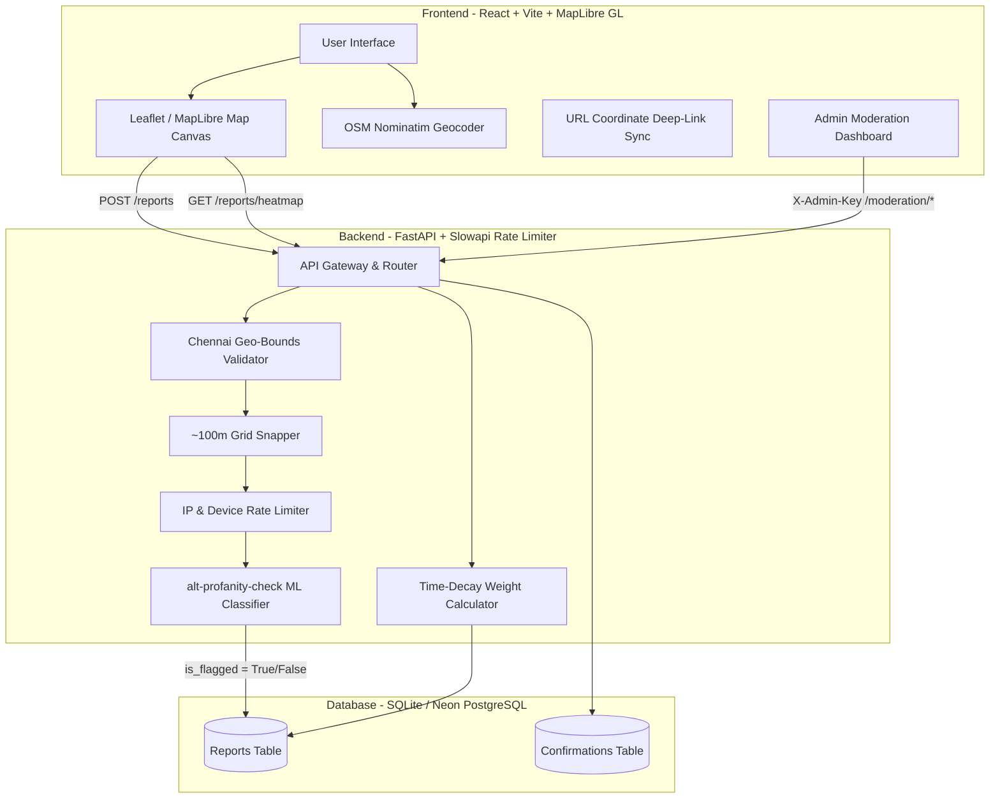
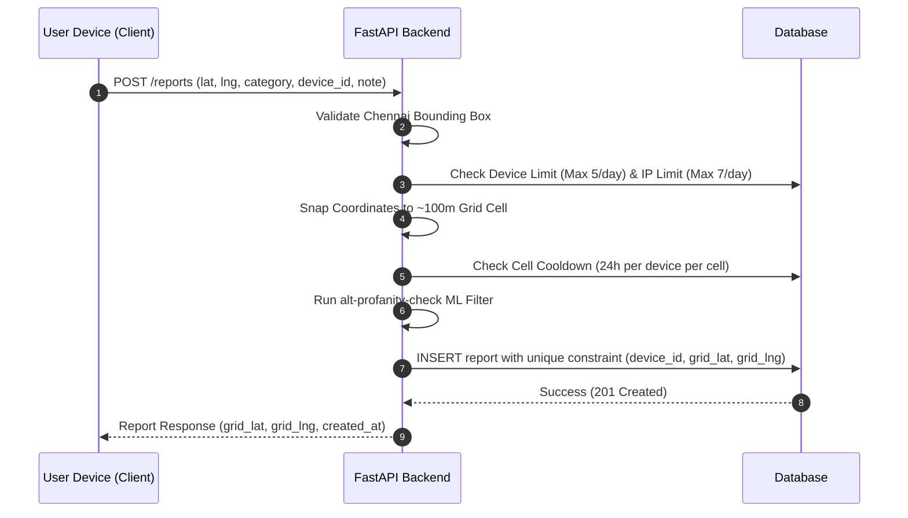
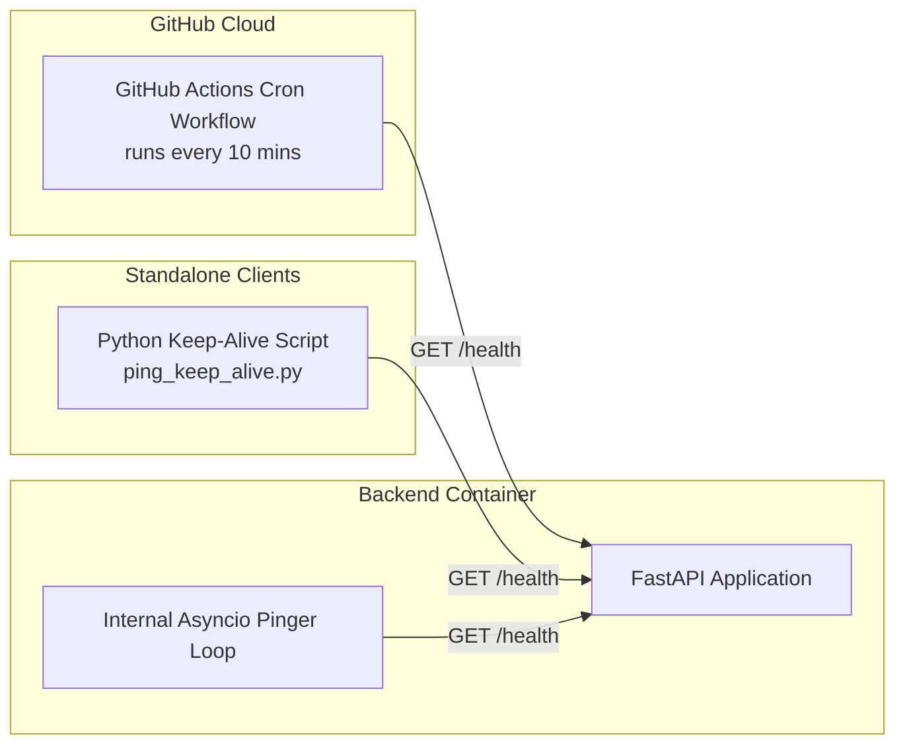

# Adiona — Chennai Safety Map

Adiona is a crowdsourced, privacy-first safety mapping platform built specifically for Chennai City. It allows citizens to report and visualize localized infrastructure hazards, lighting concerns, and women's safety issues without requiring account creation, login credentials, or personal tracking.

---

## System Architecture



---

## Privacy & Anonymity Pipeline

Adiona enforces privacy-by-design. Exact click coordinates are transformed server-side into grid cell centers before storage, ensuring exact locations cannot be reverse-engineered.

```
[Exact User Click] -> (13.0827419, 80.2707123)
       |
       v
[Chennai Bounds Check] -> Validated (12.9205°–13.2405° N, 80.1070°–80.4270° E)
       |
       v
[~100m Grid Snapping] -> Formula: round(lat / step_lat) * step_lat
       |
       v
[Grid Cell Center] -> (13.083004, 80.270589) [STORED IN DATABASE]
       |
       v
[Public API Output] -> HeatmapPoint(lat, lng, weight, category, status)
                        (device_id is NEVER exposed in public endpoints)
```

### Anonymity & Rate Limit Controls



---

## Category Specifications

Safety categories are kept strictly separated to maintain clear semantic distinctions between general infrastructure hazards and targeted concerns.

| Category Type | Category ID | Display Label | Description |
|---|---|---|---|
| **General Safety** | `poor_lighting` | Poor / No Lighting | Dark streets, non-functional streetlights |
| **General Safety** | `isolated_area` | Isolated / Deserted Area | Empty alleys, deserted walkways, abandoned spots |
| **General Safety** | `no_cctv` | No CCTV Coverage | Blind spots, unmonitored public corridors |
| **General Safety** | `stray_animal` | Stray Animal Risk | Aggressive stray dog packs, dangerous unmanaged animals |
| **General Safety** | `robbery_theft` | Robbery / Theft-Prone | Known snatching spots, mugging hazards |
| **General Safety** | `unsafe_road` | Unsafe Road / No Footpath | Broken pavement, high-speed traffic hazards |
| **General Safety** | `other_general` | Other General Issue | Other infrastructure or environment concerns |
| **Women Safety** | `catcalling` | Catcalling / Verbal Abuse | Leering, whistling, inappropriate comments |
| **Women Safety** | `stalking` | Stalking | Being followed, tracked, or persistently monitored |
| **Women Safety** | `physical_harassment` | Physical Harassment | Inappropriate contact, groping, physical threats |
| **Women Safety** | `unsafe_transport` | Unsafe Transport Stop | Poorly lit bus stops, unruly crowds, unsafe stands |
| **Women Safety** | `other_women` | Other Harassment | Other targeted harassment or threat concerns |

---

## Time-Decay Heatmap Weighting Algorithm

Heatmap point intensity automatically decays over time using an exponential decay function with a ~30-day half-life, floored at `0.10` so older unconfirmed reports fade gracefully while confirmed reports maintain visibility.

$$W(t) = \max\left(0.10, e^{-0.023 \cdot t_{\text{days}}}\right) + \text{confirmations}$$

### Weight Decay Schedule

| Report Age ($t$) | Base Decay Weight ($e^{-0.023 \cdot t}$) | Weight (0 Confirmations) | Weight (2 Confirmations) | Visual Heatmap Intensity |
|---|---|---|---|---|
| **0 Days (New)** | 1.000 | **1.000** | **3.000** | High (Red / Orange) |
| **7 Days** | 0.851 | **0.851** | **2.851** | Moderate-High (Orange) |
| **30 Days** | 0.501 | **0.501** | **2.501** | Moderate (Yellow-Orange) |
| **90 Days** | 0.126 | **0.126** | **2.126** | Low-Moderate (Cyan) |
| **180+ Days** | < 0.100 (floored) | **0.100** | **2.100** | Minimum Floor (Dim Cyan) |

---

## Moderation Queue Workflow (Spec §10)

Reports flagged by the machine learning profanity classifier (`is_flagged = True`) do not appear on the public heatmap immediately. They are routed to the Moderation Queue for review.

```
[User Submits Note] 
        |
        v
[alt-profanity-check ML Model]
        |
        +---> Clean (is_flagged = False) -----> Immediately Rendered on Heatmap
        |
        +---> Profane (is_flagged = True) ----> Held in Moderation Queue (/moderation/reports)
                                                      |
                                                      +---> Admin Approves  ---> Published to Heatmap
                                                      |
                                                      +---> Admin Deletes   ---> Permanently Removed
```

---

## API Reference Table

| Method | Endpoint | Authorization | Description |
|---|---|---|---|
| `POST` | `/reports` | Public | Submit a grid-snapped safety report |
| `GET` | `/reports/heatmap` | Public | Query heatmap points with category, hours_back, and group filters |
| `POST` | `/reports/{id}/confirm` | Public | Confirm an existing safety report (1 per device) |
| `GET` | `/moderation/reports` | Admin Key | List flagged reports requiring admin review |
| `POST` | `/moderation/reports/{id}/approve` | Admin Key | Approve a flagged report and publish to heatmap |
| `DELETE` | `/moderation/reports/{id}` | Admin Key | Permanently delete a report from database |
| `GET` | `/moderation/stats` | Admin Key | Retrieve total, flagged, and safe report statistics |
| `GET` | `/health` | Public | Health check endpoint for uptime monitoring and keep-alive |

---

## Quality Assurance & Evaluation Matrix

Adiona underwent a 6-phase evaluation pass prior to deployment:

| Phase | Evaluation Scope | Test File | Test Count | Result |
|---|---|---|---|---|
| **Phase A** | Security Testing | `backend/tests/test_security.py` | 17 tests | **PASSED** (0 SQLi, 0 out-of-bounds leaks, DB race fixed) |
| **Phase B** | Privacy Testing | `backend/tests/test_privacy.py` | 5 tests | **PASSED** (0 device_id leaks in public responses) |
| **Phase C** | Safety-Specific Risk | `backend/tests/test_safety_risk.py` | 3 tests | **PASSED** (Time-decay & moderation surfacing verified) |
| **Phase D** | Integration & Edge | `backend/tests/test_integration_edge.py` | 6 tests | **PASSED** (Full E2E flow, midnight window, edge bounds) |
| **Phase E** | Performance & Scale | `backend/tests/test_performance.py` | 2 benchmarks | **PASSED** (500 reqs < 5ms avg; 100k rows = 20.98 MB) |
| **Phase F** | Accessibility Audit | `frontend/src/test/Accessibility.test.jsx` | 24 tests | **PASSED** (Keyboard nav, screen readers, color-blind independence) |

### Test Suite Totals
- **Backend Test Suite (`pytest`)**: 73 / 73 Passed
- **Frontend Test Suite (`vitest`)**: 24 / 24 Passed
- **Production Build (`vite build`)**: Clean Succeeded

---

## Keep-Alive & Cold-Start Architecture

To prevent Render free-tier instances from spinning down after 15 minutes of inactivity, a 3-layer keep-alive system is active:



---

## Project Structure

```
Adiona/
├── .github/
│   └── workflows/
│       └── keep_alive.yml         # Scheduled 10-min GitHub Actions keep-alive workflow
├── backend/
│   ├── app/
│   │   ├── config.py              # Application settings & environment variables
│   │   ├── db.py                  # Async SQLAlchemy database engine & session dependency
│   │   ├── main.py                # FastAPI entry point & CORS configuration
│   │   ├── models.py              # SQLAlchemy models (Report, Confirmation) & unique indexes
│   │   ├── schemas.py             # Pydantic request/response validation schemas
│   │   ├── routers/
│   │   │   ├── reports.py         # POST /reports, GET /heatmap, POST /confirm
│   │   │   └── moderation.py      # Moderation queue admin endpoints
│   │   └── services/
│   │       ├── geo_validator.py   # Server-side Chennai bounding box validation
│   │       ├── grid_snap.py       # ~100m grid cell snapping logic
│   │       ├── keep_alive.py      # Background asyncio pinger loop
│   │       ├── profanity.py       # alt-profanity-check ML classifier integration
│   │       └── rate_limiter.py    # IP slowapi & device daily limiters
│   ├── scripts/
│   │   └── ping_keep_alive.py     # Standalone pinger script
│   ├── tests/                     # 73 Pytest unit, integration, and security tests
│   ├── load_seed_data.py          # Seed data generator for Chennai
│   └── requirements.txt
└── frontend/
    ├── src/
    │   ├── components/
    │   │   ├── CategoryIcon.jsx   # Dynamic Lucide icon mapper
    │   │   ├── ConfirmPrompt.jsx  # Confirmation modal dialog
    │   │   ├── FilterBar.jsx      # Category, time range, demographic filter panel
    │   │   ├── MapView.jsx        # MapLibre GL map canvas & URL parameter sync
    │   │   ├── ModerationModal.jsx# Admin moderation queue dashboard
    │   │   ├── PrivacyNotice.jsx  # Privacy notice dialog & inline banner
    │   │   ├── ReportModal.jsx   # Report safety issue dialog with scrollable body
    │   │   └── SearchBar.jsx      # OSM Nominatim Chennai locality search bar
    │   ├── hooks/
    │   │   └── useDeviceId.js     # Persistent client UUID generator (localStorage)
    │   ├── test/                  # 24 Vitest frontend & accessibility tests
    │   ├── utils/                 # API client, bounds, categories, & map constants
    │   ├── App.jsx
    │   ├── index.css              # Custom styling & scrollbar rules
    │   └── main.jsx
    ├── package.json
    └── vite.config.js
```

---

## Getting Started Locally

### Prerequisites
- Python 3.10+
- Node.js 18+

### 1. Backend Setup

```bash
cd backend
python -m venv .venv

# Windows PowerShell
.\.venv\Scripts\Activate.ps1

# Linux / macOS
source .venv/bin/activate

pip install -r requirements.txt
python load_seed_data.py
uvicorn app.main:app --reload --port 8000
```

Backend API running at: `http://127.0.0.1:8000`  
Swagger Documentation: `http://127.0.0.1:8000/docs`

### 2. Frontend Setup

```bash
cd frontend
npm install
npm run dev
```

Frontend application running at: `http://localhost:5173`

### 3. Running Test Suites

```bash
# Run backend test suite (73 tests)
cd backend
python -m pytest tests/ -v

# Run frontend test suite (24 tests)
cd frontend
npx vitest run
```

---

## License

Distributed under the MIT License. See `LICENSE` for details.